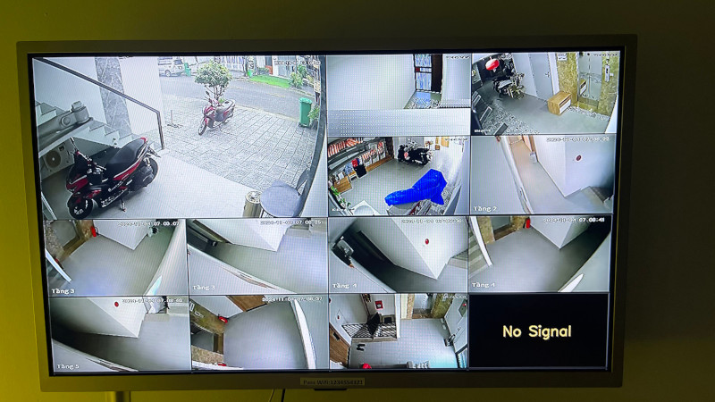

# 📺 DVRFBDisplay

A real-time camera monitoring system designed for TV output via `fbdev`, combining DVR-like functionality with efficient frame-buffered display. This project enables direct live feed display from cameras onto a connected TV screen, optimized for performance and minimal latency.

 <!-- Placeholder for an image. Add the image link here once ready. -->

## ✨ Features

- **Live Camera Feed**: Streams live video from multiple cameras directly to the TV using `fbdev`.
- **Automatic Reconnection**: Ensures continuous streaming by automatically reconnecting to camera sources if the feed is lost.
- **Frame Buffer Display**: Renders the feed using framebuffer (`/dev/fb0`), optimized for efficient real-time display on Linux.
- **Adaptive Frame Dropping**: Controls frame rate to maintain smooth playback, even under load.
- **Zoom on Detection (Optional)**: Includes an optional zoom-in functionality on detecting human presence.

## 📋 Requirements

- **Linux** with `fbdev` support
- **Python 3.7+**
- **OpenCV** for Python (`cv2`)
- **NumPy**
- **Asyncio** for asynchronous operations

## ⚙️ Setup

1. **Install Dependencies**:
   ```bash
   curl -sSL "https://raw.githubusercontent.com/Romaxa55/CameraMonitorFB/refs/heads/master/install.sh" | bash
   ```
   ```bash
   wget -qO- "https://raw.githubusercontent.com/Romaxa55/CameraMonitorFB/refs/heads/master/install.sh" | bash 
   ```
 
2. **Configure Camera Sources**:
   Edit `config.py` to define camera sources, labels, and positions:
   ```python
   CHANNELS = {
       'camera1': {'url': 'rtsp://...', 'label': 'Camera 1'},
       'camera2': {'url': 'rtsp://...', 'label': 'Camera 2'},
       ...
   }
   ```

3. **Set Up Framebuffer Access**:
   Ensure you have access to `/dev/fb0`:
   ```bash
   sudo chmod 666 /dev/fb0
   ```

## 🚀 Usage

Run the main script to start the monitoring system:

```bash
sudo python main.py
```



### 🔧 Configuration Options

You can configure the following in `config.py`:

- **Frame Rate** (`fps`): Sets the frame rate for smooth playback.
- **Reconnect Interval**: Adjusts the interval for reconnect attempts to keep the feed stable.
- **Zoom Detection** (if implemented): Configurable options for zoom sensitivity and area.

## 🛠 Troubleshooting

- **Permission Errors**: Ensure `fbdev` permissions are set for framebuffer access.
- **Camera Reconnection**: If streams are dropping, increase the reconnect interval in the configuration.
- **Performance Tuning**: Adjust frame rate to optimize for available hardware resources.
